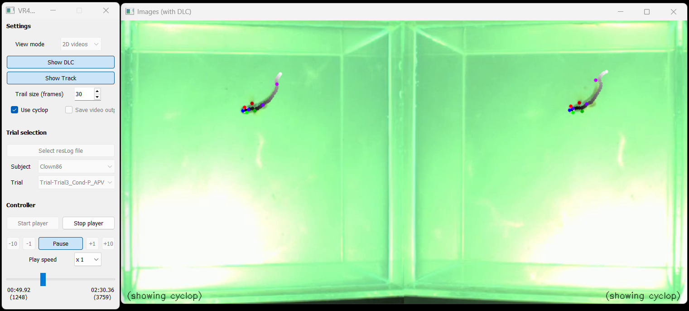

# NemoVR-Viewer

A Python-based viewer for fish tracking experiments. Displays synchronized multi-camera videos with overlaid 2D/3D tracking results and DeepLabCut (DLC) pose estimation markers.



---

## Full Documentation

The complete NemoVR-Viewer documentation is available here:

[NemoVR-Viewer Documentation](https://anr-brainvr.github.io/NemoVR-Viewer/)

---


# Requirements

Create the conda environment with:

```bash
conda create --name DLC-live3 -c conda-forge python=3.12 numpy matplotlib pyqt opencv
```

Then activate it:

```bash
conda activate DLC-live3
```

---

# Files

| File           | Description                                               |
| -------------- | --------------------------------------------------------- |
| `Viewer.py`    | Main script — launch this to start the viewer             |
| `Settings.txt` | Configuration file (paths, camera setup, display options) |

---

# Usage

Before launching the viewer for the first time, you must configure the location of your tracking results.

Open:

```text
Settings.txt
```

Locate the following line:

```text
resultsDir
```

and modify it to point to your tracking results folder.

Example:

```text
resultsDir    'C:/Users/Desktop/Results'
```

Use a full absolute path to the tracking results directory.

Save the file once the modification is complete.

---

Once the settings are configured, launch the viewer with:

```bash
python Viewer.py
```

The NemoVR-Viewer graphical interface should now open.

---

## 1. Select the tracking log file

Inside the GUI, click:

```text
Select resLog file
```

A file explorer window will open.

Navigate to your tracking results folder and select the `.tsv` tracking log file generated by the tracking pipeline.

This file contains the information required to load:

* experiments
* subjects
* trials
* associated tracking files

---

## 2. Select a subject

Once the tracking log file has been loaded, available subjects will appear in the `Subject` dropdown menu.

Select the subject you want to visualize.

---

## 3. Select a trial

After selecting a subject, available trials will appear in the `Trial` dropdown menu.

Choose the trial you want to load.

The viewer will automatically search for the corresponding:

* videos
* DLC files
* tracking results
* 3D reconstruction files

---

## 4. Configure the viewer

Several visualization options can be configured directly from the GUI.

Available options include:

* visualization mode (`2D videos` or `3D plots`)
* DLC marker display
* tracking trajectory display
* trail size
* playback speed
* video export

These settings allow the visualization to be adapted depending on the experiment and analysis requirements.

---

## 5. Start playback

Click:

```text
Start player
```

The viewer will load the selected files and initialize playback.

Depending on the file size and number of cameras, loading may take a few seconds.

---

## 6. Control playback

Use:

```text
Play / Pause
```

to start or pause the visualization.

Additional controls include:

* frame slider navigation
* jump ±1 frame
* jump ±10 frames
* playback speed selection
* timeline navigation

The viewer also displays:

* current frame
* elapsed time
* total duration
* total frame count

# GUI Settings

Default values can be changed in `Settings.txt`.

## View mode

Select visualization mode:

* `2D videos` → synchronized camera videos with overlays
* `3D plots` → reconstructed 3D trajectories

---

## Show DLC

Display DeepLabCut inferred markers.

---

## Show Track

Display tracking positions and trajectories.

---

## Trail size (frames)

Controls the length of the visible trajectory trail.

Higher values display longer movement histories.

---

## Use cyclop

Uses inferred cyclop positions instead of raw detected tracking points.

---

## Save video output

Exports videos with overlays or 3D visualizations.

---

## Play speed

Available playback speeds:

* x1/8
* x1/4
* x1/2
* x1
* x2
* x4
* x8

---

## Slider

Allows direct navigation through frames.

Displays:

* current frame
* elapsed time
* total duration
* total frame count

---

# Settings

Edit `Settings.txt` to configure the viewer.

| Parameter     | Description                                                 |
| ------------- | ----------------------------------------------------------- |
| `speciesName` | Fish species (`'Clownfish'`, `'Surgeonfish'`, etc.)         |
| `resultsDir`  | Path to the results directory                               |
| `viewMode`    | `2` = 2D videos, `3` = 3D plots                             |
| `showDLC`     | Show DeepLabCut markers                                     |
| `showTrack`   | Show animal tracking trail                                  |
| `trailFrames` | Trail length in frames (1–60)                               |
| `speed`       | Playback speed (`0.125`, `0.25`, `0.5`, `1`, `2`, `4`, `8`) |
| `camList`     | Cameras to use, e.g. `[0, 1]`                               |
| `cropSize`    | ROI size in pixels, e.g. `(500, 500)`                       |
| `saveVideos`  | Save output video with overlay (`True`/`False`)             |

---

# Supported Species

DLC marker configs are included for:

* Anemonefish
* Surgeonfish
* Aruanus
* Damselfish
* Cod

---

# Notes

## Note 1

The file architecture follows the general NemoVR project organization.

The `.npy` result files are generated by the tracking pipeline.

Expected structure:

```text
Results/
└── EXPERIMENT_ID/
    └── SUBJECT_ID/
        ├── Trial_cam0.mp4
        ├── Trial_cam1.mp4
        ├── Trial_DLC2D.npy
        ├── Trial_DLC3D.npy
        └── ...
```

---

## Note 2

Most viewer parameters can be modified directly inside:

```text
Settings.txt
```

Including:

* result paths
* playback defaults
* DLC display
* tracking display
* camera configuration
* crop settings
* rotations
* export settings

---

The `xMonitWin` setting controls where the video window opens on screen and may need adjustment depending on your monitor layout.
