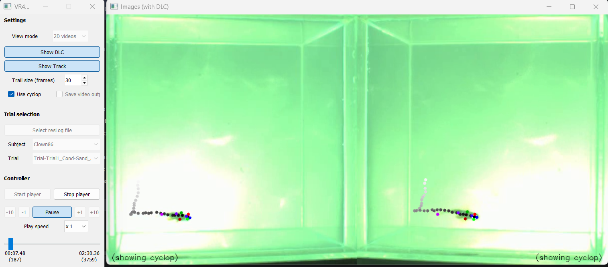

# NemoVR-Viewer

A Python-based viewer for fish tracking experiments. Displays synchronized multi-camera videos with overlaid 2D/3D tracking results and DeepLabCut (DLC) pose estimation markers.

> ⚠️ **Windows only**



---

## Requirements

- Python 3.x
- PyQt5
- OpenCV (`cv2`)
- NumPy
- Matplotlib

```bash
pip install pyqt5 opencv-python numpy matplotlib
```

---

## Files

| File | Description |
|------|-------------|
| `Viewer.py` | Main script — launch this to start the viewer |
| `Settings.txt` | Configuration file (paths, camera setup, display options) |

---

## Usage

```bash
python Viewer.py
```

1. **Define your results path** — open `Settings.txt` and set `resultsDir` to your results folder:
   ```
   resultsDir    r'C:\path\to\your\Results\\'
   ```
2. Select a `.tsv` results log file via **"Select resLog file"**
3. Choose a subject and trial from the dropdowns
4. Click **"Start player"** then **"Pause"** to play

---

## Settings

Edit `Settings.txt` to configure the viewer. Key parameters:

| Parameter | Description |
|-----------|-------------|
| `speciesName` | Fish species (`'Clownfish'`, `'Surgeonfish'`, etc.) |
| `resultsDir` | Path to the results directory |
| `viewMode` | `2` = 2D videos, `3` = 3D plots |
| `showDLC` | Show DeepLabCut markers |
| `showTrack` | Show animal tracking trail |
| `trailFrames` | Trail length in frames (1–60) |
| `speed` | Playback speed (`0.125`, `0.25`, `0.5`, `1`, `2`, `4`, `8`) |
| `camList` | Cameras to use, e.g. `[0, 1]` |
| `cropSize` | ROI size in pixels, e.g. `(500, 500)` |
| `saveVideos` | Save output video with overlay (`True`/`False`) |

---

## Supported Species

DLC marker configs are included for: **Anemonefish**, **Surgeonfish**, **Aruanus**, **Damselfish**, **Cod**

---

## Notes

- Results files must follow the naming convention `<expID>/<subjectID>/<file>_cam0.mp4`, `..._DLC2D.npy`, etc.
- The `xMonitWin` setting controls where the video window opens on screen (adjust for your monitor layout).
