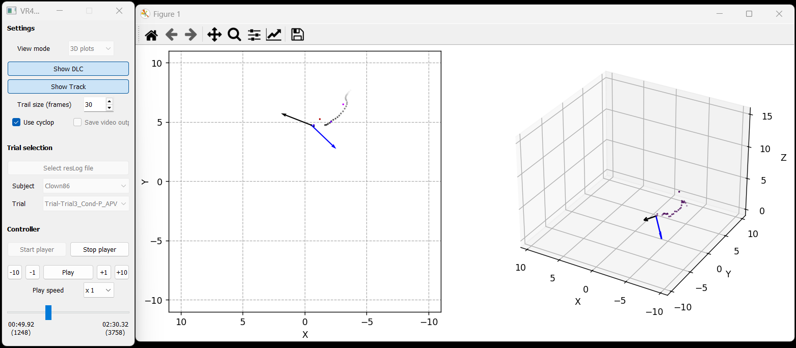

This page presents examples of the NemoVR-Viewer graphical interface and visualization modes.

---

# 2D Video Visualization

The 2D visualization mode displays synchronized camera recordings together with tracking overlays and DeepLabCut markers.

Features visible in this mode include:

* synchronized multi-camera playback
* DeepLabCut keypoints
* trajectory trails
* playback controls
* frame navigation
* real-time visualization

---

# 3D Trajectory Visualization

The 3D visualization mode displays reconstructed trajectories in a 3D environment.

This mode is useful for:

* spatial trajectory analysis
* movement visualization
* trajectory reconstruction validation
* multi-camera reconstruction inspection

---

# GUI Features

The viewer interface provides:

* subject and trial selection
* playback controls
* visualization mode selection
* trajectory display options
* DLC visualization
* export settings
* frame slider navigation

---

# Notes

The displayed examples depend on:

* the selected species
* tracking quality
* camera configuration
* selected visualization settings
* available DLC inference files
